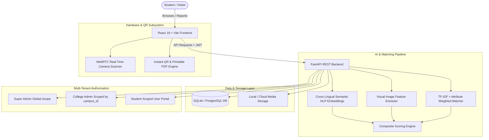

# 🔍 khojbeen.ai (खोजबीन)

> **"Khoya hai? Khojbeen karega."**  
> *Next-Gen Multi-Campus Intelligent Lost & Found Ecosystem*  
> **Built for Hackathon 2026 — Problem Statement 02**

---

## 📑 Table of Contents
1. [Executive Summary & Problem Statement](#-executive-summary--problem-statement)
2. [Key Highlights & Innovation](#-key-highlights--innovation)
3. [End-to-End System Architecture](#-end-to-end-system-architecture)
4. [Detailed Feature Breakdown](#-detailed-feature-breakdown)
   - [1. AI Multi-Modal Matching Engine](#1--ai-multi-modal-matching-engine-the-brain)
   - [2. "Tag My Item" Pre-Registration & QR Ecosystem](#2--tag-my-item-pre-registration--qr-ecosystem)
   - [3. Universal Live QR Scanner](#3--universal-live-qr-scanner-tab)
   - [4. Multi-Tenant Scoped Campus & Super Admin Hierarchy](#4--multi-tenant-scoped-campus--super-admin-hierarchy)
   - [5. Cross-College Privacy-Preserving Federation](#5--cross-college-privacy-preserving-federation)
   - [6. Draggable Multilingual AI Chatbot](#6--draggable-multilingual-ai-assistant)
   - [7. Student Self-Service Portal & Claim Management](#7--student-self-service-portal--claim-management)
   - [8. UI/UX, Security & 9-Language Localization](#8--uiux-security--9-language-localization)
5. [Slide-by-Slide Presentation Guide (For PPT / Demo)](#-slide-by-slide-presentation-guide-for-ppt--demo)
6. [Demo Credentials & Test Accounts](#-demo-credentials--test-accounts)
7. [Tech Stack](#-tech-stack)
8. [Installation & Quick Start](#-installation--quick-start)
9. [Testing & Verification](#-testing--verification)

---

## 📌 Executive Summary & Problem Statement

### The Problem
In modern universities and collegiate networks:
* **The Description Mismatch Problem:** A student reports a *"black matte water flask with a small dent"*, while the cafeteria cleaner logs a *"black Milton-style bottle"*. Keyword-only search fails completely.
* **Loss of Belongings is Reactive:** Students only search *after* an item is lost. By then, lost items are often misplaced, discarded, or stolen without any proof of ownership.
* **Privacy Vulnerabilities:** Writing personal phone numbers on sticky notes or physical tags invites harassment and privacy violations.
* **Campus Isolation:** Students frequently visit other campuses, libraries, or fests. If an item is lost across college borders, no shared channel exists.
* **Administrative Burden:** College lost & found counters are flooded with unverified claims, disputes, and manually managed paper logs.

### The Khojbeen.ai Solution
**Khojbeen.ai** is an AI-powered, multi-tenant lost & found platform that unites **Multi-Modal AI Matching (NLP + Computer Vision)**, **Pre-Emptive QR Protection ("Tag My Item")**, **Cross-Campus Federated Search**, and a **Zero-PII-Leakage Privacy Relay** into a cohesive web experience.

---

## 🌟 Key Highlights & Innovation

```
┌─────────────────────────────────────────────────────────────────────────────────┐
│                               khojbeen.ai Core Engine                           │
├───────────────────────┬─────────────────────────┬───────────────────────────────┤
│   🧠 Multi-Modal AI   │   🏷️ QR Tag Ecosystem   │   🌐 Cross-Campus Federation │
│  • Multilingual NLP   │  • Pre-emptive tagging  │  • Multi-college search       │
│  • Visual Embeddings  │  • Printable 6-pack     │  • Portal inquiry relay       │
│  • Fuzzy Attributes   │  • Zero-PII public scan │  • Scoped college isolation   │
├───────────────────────┼─────────────────────────┼───────────────────────────────┤
│   🛡️ Multi-Role RBAC  │   🤖 AI Voice Assistant │   🌍 9-Language Parity        │
│  • Super Admin        │  • Draggable Widget     │  • EN, HI, BN, TA, TE, MR,    │
│  • College Admin      │  • Multi-turn FAQ       │    GU, PA, UR (Full RTL)      │
│  • Faculty & Student  │  • Zero fallback NLP    │  • Dark / Light Mode          │
└───────────────────────┴─────────────────────────┴───────────────────────────────┘
```

---

## 🏗️ End-to-End System Architecture



---

## 🚀 Detailed Feature Breakdown

### 1. 🧠 AI Multi-Modal Matching Engine (The Brain)
* **Hybrid 3-Stage Match Pipeline:**
  1. **Semantic Text Embeddings:** Uses transformer-based cross-lingual embeddings to calculate contextual meaning, bridging language and terminology gaps (e.g., *"chashma"* vs *"reading glasses"* vs *"spectacles"*).
  2. **Visual Similarity Matcher:** Computes image vector embeddings to compare uploaded photos of lost and found items.
  3. **Fuzzy Attribute Matcher:** Evaluates Category, Brand, Color, Location, and Date Proximity with dynamic penalty scores for hard mismatches.
* **Real-Time Automated Matching:** Whenever a Lost or Found report is submitted, the system automatically compares it against all active items, computes confidence scores (0–100%), and generates mutual match records.
* **Threshold-Based Alerts:** High-confidence matches automatically trigger instant in-app alerts and notifications to both the owner and finder.

---

### 2. 🏷️ "Tag My Item" Pre-Registration & QR Ecosystem
* **Pre-Emptive Protection:** Students can pre-register up to **20 personal belongings** (laptops, bottles, bags, ID cards, keys) *before* losing them.
* **Unique Code Generation:** Generates tamper-proof unique identifiers (e.g., `KB-94A82F10`) permanently tied to the student's inventory.
* **Printable Waterproof Stickers:**
  * **Single Sticker View:** Optimized for individual label printers with item name, ID, and QR code.
  * **Sheet of 6 Stickers (A4/Letter Layout):** Batch-print all personal belongings in one click.
* **1-Click Status Lifecycle:**
  * `Safe`: Item is secure with the student.
  * `Lost`: 1-click transition converts the tagged item into an active Lost Report linked to the **exact same QR code**, immediately triggering AI matching.
  * `Recovered`: 1-click restore marks the item safe and closes active claims.
* **Zero-PII Privacy Protection (`/item/{code}`):**
  * Anyone who scans the QR code sees only the item name, photo, status, and college affiliation.
  * **Zero PII Exposure:** The owner's name, mobile number, email, and roll number are NEVER shown publicly.
  * **Anonymous Owner Relay:** The finder clicks *"Notify Owner"*, instantly sending an automated scan alert with timestamp to the student's dashboard.

---

### 3. 📷 Universal Live QR Scanner Tab (`/scan`)
* **Dedicated Public Route:** Accessible from the left sidebar without requiring user login.
* **Dual Scanning Modes:**
  * **WebRTC Live Viewfinder:** High-frame-rate camera stream with target laser animation, camera switch (Front/Back), and torch/flashlight toggle. Automatically releases hardware camera stream on tab switch.
  * **Image File & Clipboard Upload:** Drag-and-drop QR images or paste directly from clipboard (`Ctrl+V`) for instant decoding.
* **Manual Code Entry:** Fallback input for physical labels where the QR code might be scuffed or damaged.
* **Security Validation:** Validates `KB-XXXXXXXX` code format and domain integrity, rejecting fraudulent or third-party QR codes with clear user feedback.

---

### 4. 🏛️ Multi-Tenant Scoped Campus & Super Admin Hierarchy
* **Role-Based Access Control (RBAC):**
  * `super_admin`: Global platform controller with cross-campus analytics, campus provisioning, and administrator onboarding.
  * `college_admin`: Campus coordinator restricted strictly to their assigned `campus_id` at the database query level (enforcing multi-tenant data isolation).
  * `faculty`: Departmental coordinators serving as physical drop-off and collection points.
  * `student`: Authenticated student managing personal reports, tagged items, and claims.
* **College Admin Dashboard (`/admin`):**
  * **Real-time Overview:** Live metrics for Lost, Found, AI Matched, Recovered, Pending Claims, and Active Tagged Items.
  * **Item Management:** Approve, verify, resolve, or archive lost/found submissions.
  * **Claims Resolution:** Review student proof of ownership, verify answers to secret verification questions, and approve item handovers.
  * **Faculty Coordinator Management:** Add and manage department coordinators.
  * **Cross-College Inquiries Inbox:** Manage item inquiries sent by students from other institutions.
* **Super Admin Dashboard (`/super-admin`):**
  * Network-wide health metrics and campus comparison charts.
  * Provision new colleges with custom slugs, logos, contact desks, and federation rules.

### 4. 🏢 College Admin & Super Admin Command Center
* **Interactive Metric Cards:** All overview stat cards (Total Reports, Open Lost, Open Found, AI Matched, Claimed, Closed/Resolved, Active Students, QR Scan Events) are keyboard-focusable and link directly with pre-filtered views.
* **AI Matches Command Center (`/admin/matches`):**
  * Pair-row visualization (`[Lost Report] <-> [Found Report]`) with match score chips, verdicts (Strong 80%+, Possible 50-79%, Weak <50%), status lifecycle, and direct Review action.
  * Multi-dimensional filtering by status, verdict, date range, and keyword search.
* **Deep Match Review Screen (`/admin/matches/:id`):**
  * Side-by-side comparison of lost vs found items (photos, metadata, location proximity, timestamps, QR-scan badges).
  * Circular score gauge (0-100%) and granular breakdown bars (Semantic NLP, Visual Similarity, Attributes).
  * Positive highlight chips ("Same color", "Same brand", "Found 40m away") and penalty mismatch chips ("Different brand") with keyword highlighting.
  * Claim verification block (claimant info, proof text, secret question verification with tick/cross check, zoomable receipts).
  * Decision bar: **Approve Handover** (triggers 4-digit handover code), **Reject** (with required audit reason), or **Ask for More Proof**.
* **Mascot & UI Layout Optimization:**
  * Non-intrusive draggable mascot with bottom/right safe padding.
  * Accurate single-route sidebar highlighting.
  * Horizontal swipe/scroll tab-bar with fade edges for complete accessibility on all viewports.

---

### 5. 🏷️ Privacy-Safe Finder 3-Option Flow & Secure Handover
* **3-Option Public Scan Interface (`/item/:code`):**
  * **Option A (Anonymous Message):** Finder sends a quick-reply message ("I found your item", "Left at front desk") with location and optional photo without creating an account.
  * **Option B (Coordinator Handover):** Finder selects a faculty coordinator / Lost & Found desk from the college directory with expected handover timing.
  * **Option C (Direct Verified Contact):** Finder shares contact info + preferred campus public meeting point with mandatory consent; details remain strictly masked until admin claim verification.
* **4-Digit Secure Handover Verification:**
  * On admin claim approval, a secure 4-digit OTP is generated for the owner.
  * The coordinator/finder enters the code at collection via `/api/students/verify-handover` with rate-limiting and brute-force lockout.

---

### 6. 🌐 Cross-College Privacy-Preserving Federation
* **Federated Multi-Campus Search (`/search`):** Search lost/found items within your home campus or toggle **"All Colleges"** across the participating university network.
* **Institutional Badging:** Cards clearly indicate the source campus with badges and college logos.
* **Secure Portal Inquiries ("Contact via Portal"):**
  * If a student spots their lost item at another campus, they initiate a portal inquiry.
  * The message is routed to the destination campus admin's inbox, keeping both students' direct contact info private until verified by staff.

---

### 6. 🤖 Draggable Multilingual AI Assistant
* **Floating Interactive Widget:** Minimize, maximize, or drag across the screen without blocking core UI elements.
* **Natural Language Campus Search:** Ask queries like *"Maine library me blue water bottle kho di hai"* and get instant item recommendations.
* **Zero-Fallback Knowledge Base:** Trained on all platform policies, QR tag instructions, claim processes, and counter timings across **all 9 supported Indian languages**.

---

### 7. 🎓 Student Self-Service Portal & Claim Management
* **Student Dashboard (`/dashboard`):**
  * **My Lost/Found Reports:** Track status (`Reported`, `Matched`, `Claim Pending`, `Resolved`).
  * **Tagged Items Manager:** View safe/lost toggles and download QR stickers.
  * **Active Claims Tracker:** Submit proof of ownership, upload purchase receipts or identifying marks, and track admin review.
  * **In-App Notification Bell:** Real-time notifications for new matches, claim approvals, and QR scan alerts.

---

### 8. 🎨 UI/UX, Security & 9-Language Localization
* **Design System:** Sleek Emerald & Slate aesthetic (`#10B981` / `#0D9488`), glassmorphic panels, animated stats counters, and smooth micro-interactions.
* **Theme Support:** Fully synchronized **Dark Mode** and **Light Mode** with persistent local storage.
* **9 Indian Languages with Full RTL Support:**
  * English (`en`), Hindi (`hi`), Bengali (`bn`), Tamil (`ta`), Telugu (`te`), Marathi (`mr`), Gujarati (`gu`), Punjabi (`pa`), and Urdu (`ur` with automatic right-to-left UI flip).
* **Anti-Bot & Spam Protection:** Cloudflare Turnstile verification and hidden honeypot traps on all public forms.

---

## 📊 Slide-by-Slide Presentation Guide (For PPT / Demo)

| Slide # | Slide Title | Key Points to Cover | Demo / Screen to Show |
| :--- | :--- | :--- | :--- |
| **Slide 1** | **Title & Vision** | Project Name: **Khojbeen.ai** — *"Khoya hai? Khojbeen karega."* Multi-Campus AI Lost & Found. | Landing Page with Modern Hero & Language Selector |
| **Slide 2** | **The Problem** | 1. Description mismatches fail keyword search.<br>2. Lost & Found is reactive, not proactive.<br>3. Privacy issues with public contact details.<br>4. Cross-campus communication gap. | Problem statement diagram / Real-world lost item stats |
| **Slide 3** | **Innovation 1: Multi-Modal AI Matcher** | Cross-lingual semantic NLP + visual embeddings + attribute weighting. Solves description discrepancies. | Live match demo: Report Lost + Found with different phrasing |
| **Slide 4** | **Innovation 2: "Tag My Item" Pre-Registration** | Proactive protection: Tag belongings *before* losing them. Printable 6-pack waterproof QR stickers. 1-click status flip. | Student Dashboard -> Tagged Items -> Sticker Print Modal |
| **Slide 5** | **Innovation 3: Universal QR Scanner & Privacy** | Public camera/gallery scanner. Zero PII exposure on public scan. Anonymous owner notification relay. | `/scan` Tab -> Scan QR -> Privacy-safe item scan page |
| **Slide 6** | **Innovation 4: Cross-College Federation** | Multi-tenant architecture. Scoped campus admins. Cross-campus search with secure portal inquiries. | `/search` with "All Colleges" filter + Admin Inquiries Inbox |
| **Slide 7** | **Innovation 5: Multilingual AI Chatbot & UX** | 9 Indian languages (with Urdu RTL), floating draggable AI assistant, dark/light theme, turnstile security. | Interactive Chatbot demo in Hindi/English + RTL toggle |
| **Slide 8** | **System Architecture & Tech Stack** | FastAPI + React 18 + Vite + TailwindCSS + SQLite/PostgreSQL + SentenceTransformers + Scikit-Learn. | Architecture Flowchart & Tech Stack Badges |
| **Slide 9** | **Live Demo & Test Accounts** | Showcase Super Admin, College Admin, and Student roles live. | Live evaluation walkthrough with demo credentials |
| **Slide 10** | **Conclusion & Future Roadmap** | Blockchain tamper-proof audit trail, IoT Bluetooth beacon integration, automated SMS/WhatsApp alerts. | Q&A / Thank You slide |

---

## 🔑 Demo Credentials & Test Accounts

> ⚠️ *Use these credentials for evaluation and testing:*

### 🎓 1. Student Portal Accounts
**Login URL:** [http://localhost:5173/student/login](http://localhost:5173/student/login)

| Name | Email (Username) | Password | Campus / College |
| :--- | :--- | :--- | :--- |
| **Aarav Sharma** | `aarav.sharma@campus.edu` | `Student@12345` | Jagran Main Campus |
| **Priya Verma** | `priya.v@campus.edu` | `Student@12345` | Jagran Main Campus |
| **Karan Malhotra** | `student.city@jagran.edu` | `Student@12345` | Jagran City Campus |
| **Sanya Kapoor** | `student.jim@jagran.edu` | `Student@12345` | Jagran Institute of Management |

---

### 🛡️ 2. Admin Portal Accounts
**Admin Login URL:** [http://localhost:5173/admin/login](http://localhost:5173/admin/login)

| Role | Username | Password | Scope / Dashboard |
| :--- | :--- | :--- | :--- |
| **Super Admin** | `superadmin` | `SuperAdmin@12345` | Global Multi-Campus (`/super-admin`) |
| **Main Campus Admin** | `campus_admin1` | `Admin@12345` | Jagran Main Campus (`/admin`) |
| **City Campus Admin** | `campus_admin2` | `Admin@12345` | Jagran City Campus (`/admin`) |
| **JIM Campus Admin** | `campus_admin3` | `Admin@12345` | JIM Campus (`/admin`) |
| **Legacy Admin** | `admin` | `admin123` | Default Campus (`/admin`) |

---

## 💻 Tech Stack

### Frontend
* **Core:** React 18, Vite, React Router v6
* **Styling & Icons:** TailwindCSS, Lucide React, Glassmorphism Design System
* **Scanning & Media:** `html5-qrcode`, WebRTC Camera API, Canvas 2D
* **Internationalization:** `i18next` (9 languages with RTL support)
* **Animation:** Smooth transitions, Canvas-confetti, dynamic laser scanner

### Backend
* **Framework:** FastAPI (Python 3.11+)
* **Database & ORM:** SQLite / PostgreSQL, SQLAlchemy 2.0
* **Security & Auth:** Python-Jose (JWT), Passlib / Bcrypt, Cloudflare Turnstile
* **Machine Learning & NLP:** Scikit-learn (TF-IDF Cosine Similarity), Sentence-Transformers, Vector similarity
* **QR Generation:** Python `qrcode`, Pillow (PIL)

---

## ⚡ Installation & Quick Start

### 1️⃣ Clone & Run in 1 Click (Windows)
Double-click `start-dev.bat` or run:
```powershell
.\start-dev.bat
```
This automatically starts both the FastAPI backend (`:8000`) and the Vite frontend (`:5173`) in separate windows.

---

### 2️⃣ Manual Setup

#### Backend Setup
```powershell
cd backend
python -m venv venv
venv\Scripts\activate
pip install -r requirements.txt
python -m app.seed
uvicorn app.main:app --reload --port 8000
```
* **API Documentation (Swagger):** `http://localhost:8000/docs`
* **Health Check:** `http://localhost:8000/api/health`

#### Frontend Setup
```powershell
cd frontend
npm install
npm run dev
```
* **Application URL:** `http://localhost:5173`

---

## 🧪 Testing & Verification

### Run Pytest Test Suite
```powershell
backend\venv\Scripts\pytest.exe backend\tests -v
```
* **Status:** 16 test suites passing (covering multi-campus scoping, QR tagging, AI matching, and claim validation).

### Run Chatbot 9-Language KB Evaluation
```powershell
backend\venv\Scripts\python.exe test_chatbot_kb.py
```
* **Status:** 36 cross-lingual queries passing with 100% confidence.

### Frontend Production Build
```powershell
cd frontend
npm run build
```
* **Status:** Clean production bundle with zero warnings.

---

## 👥 Contributors & Hackathon Credits
* **Developed by:** Team Khojbeen.ai
* **Institution:** Jagran College of Art, Science & Commerce
* **Hackathon:** Hackathon 2026 — Problem Statement 02
